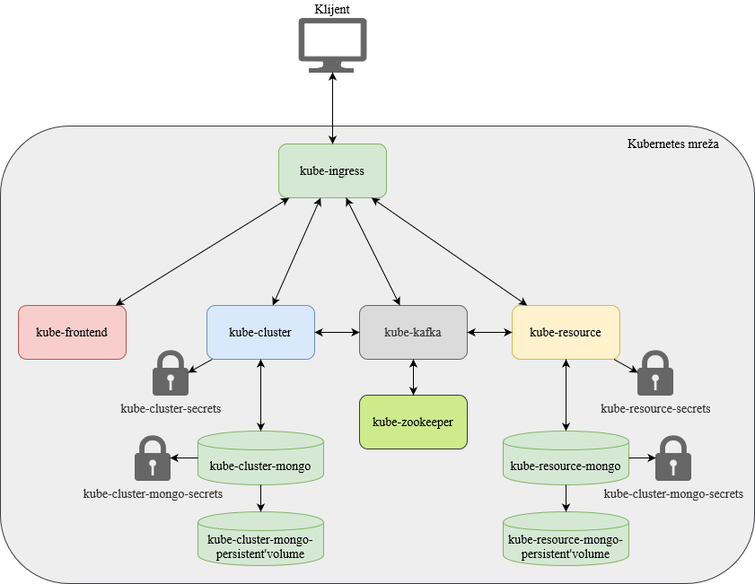
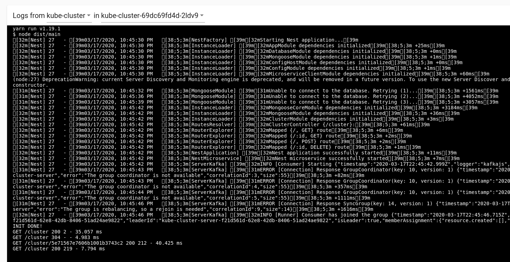

# Kubernetes app example

## Overview

There are two REST API services: `kube-cluster` and `kube-resource`. These services expose REST API and they are connected to Kafka. Kafka is used for communication between them when there is object manipulation (example cluster is created or deleted). Data from the service is stored in MongoDB, and they have separate MongoDB instance.

`kube-frontend` is JS single-page application that is showing the objects from the REST services and it is the UI for manipulation of the REST API objects.

For external communication there is Ingress object that exposes the rest API services and the frontend service.

Sensitive variables are passed using Secret object.

## Architecture


Kubernetes objects



## Kubernetes objects

Kubernetes objects are located in `kubernetes` folder.

### Deployment and service
Specification of container image, number of replicas, connection to secrets object, connection to volumes and network settings

[kubernetes/kube-cluster-deployment.yaml](kubernetes/kube-cluster-deployment.yaml)
```yaml
apiVersion: v1
kind: Service
metadata:
  name: kube-cluster
  labels:
    app: kube-cluster
spec:
  type: ClusterIP
  ports:
    - port: 3000
      targetPort: 3000
  selector:
    app: kube-cluster

---
apiVersion: apps/v1
kind: Deployment
metadata:
  name: kube-cluster
  labels:
    app: kube-cluster
spec:
  selector:
    matchLabels:
      app: kube-cluster
  replicas: 2
  template:
    metadata:
      labels:
        app: kube-cluster
    spec:
      containers:
        - name: kube-cluster
          image: jkostov/kube-cluster:latest
          envFrom:
            - secretRef:
                name: kube-cluster-secrets

```

### Secret

Base64 encoded sensitive data

[kubernetes/kube-cluster-secrets.yaml](kubernetes/kube-cluster-secrets.yaml)
```yaml
apiVersion: v1
kind: Secret
metadata:
  name: kube-cluster-secrets
type: Opaque
data:
  NODE_ENV: cHJvZHVjdGlvbg==
  APP_PORT: MzAwMA==
  KAFKA_URL: a3ViZS1rYWZrYTo5MDky
  MONGO_URL: bW9uZ29kYjovL3Jvb3Q6cm9vdDEyMzRAa3ViZS1jbHVzdGVyLW1vbmdvOjI3MDE3L2RhdGFiYXNl

```

### Ingress

Load balancer and reverse proxy for exposing the services from the kubernetes cluster

[kubernetes/kube-ingress.yaml](kubernetes/kube-ingress.yaml)
```yaml
apiVersion: networking.k8s.io/v1beta1
kind: Ingress
metadata:
  name: kube-ingress
spec:
  rules:
    - host: kube-app.test
      http:
        paths:
          - path: /
            backend:
              serviceName: kube-frontend
              servicePort: 80
          - path: /cluster
            backend:
              serviceName: kube-cluster
              servicePort: 3000
          - path: /resource
            backend:
              serviceName: kube-resource
              servicePort: 3001

```

### Persistent Volume Claim

Filesystem storage that can be mounted on service as volume

[kubernetes/kube-cluster-mongo-persistent-volume.yaml](kubernetes/kube-cluster-mongo-persistent-volume.yaml)
```yaml
apiVersion: v1
kind: PersistentVolumeClaim
metadata:
  labels:
    app: kube-cluster-mongo-persistent-volume
  name: kube-cluster-mongo-persistent-volume
spec:
  selector:
    matchLabels:
      app: kube-cluster-mongo-persistent-volume
  volumeMode: Filesystem
  accessModes:
    - ReadWriteOnce
  resources:
    requests:
      storage: 500Mi

```

## Demo

[Minikube](https://minikube.sigs.k8s.io/docs/) is used for running the demo.

### UI

Clusters page - you can create new cluster, delete cluster and assign resources to a cluster.


Cluster resources page - You can add new resource to a cluster or delete one.


### Kubernetes dashboard


### Messages

When cluster is deleted, `cluster.deleted` message is sent, and the `kube-resource` service deletes resources for the deleted cluster.

When resource is created for a cluster, `resource.created` message is sent, and the `kube-cluster` services updates the cluster object. Also, when resource of cluster is deleted, `resource.deleted` is sent and the cluster object is updated.

Because there are 2 replicas of the cluster service, only one service is handling the kafka messages.




In the logs above we can see that client request are balanced and sent to each replica. Also, we can see that only one replica is getting the kafka messages.